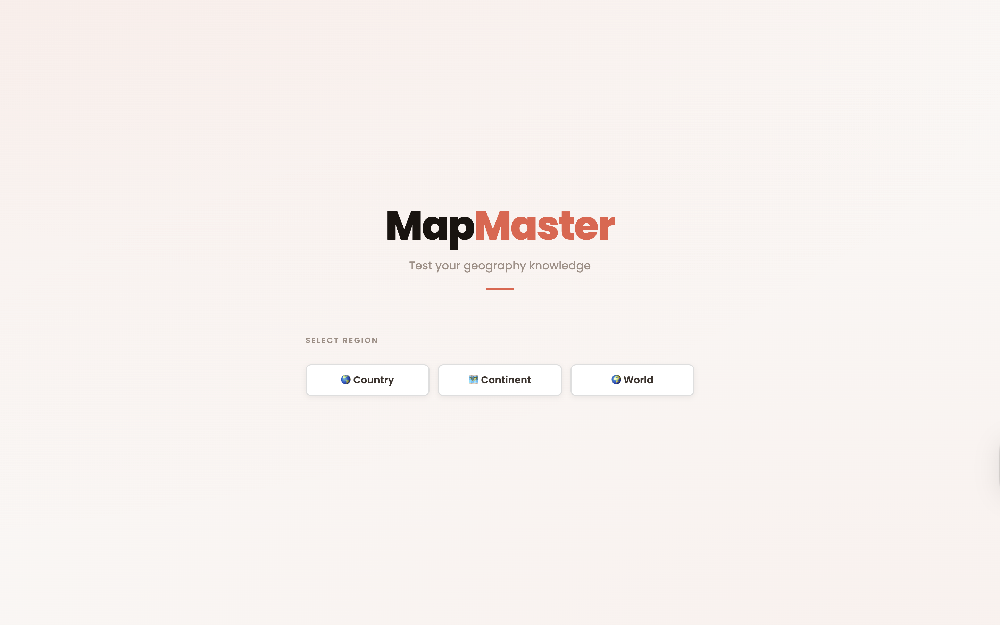
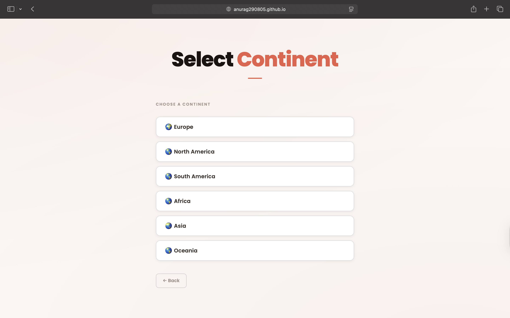
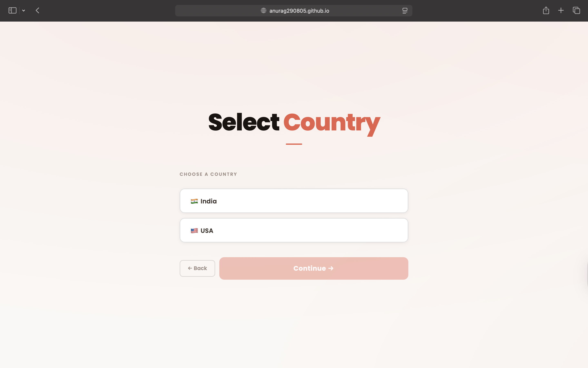
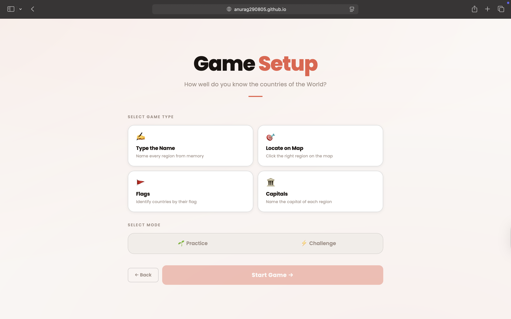
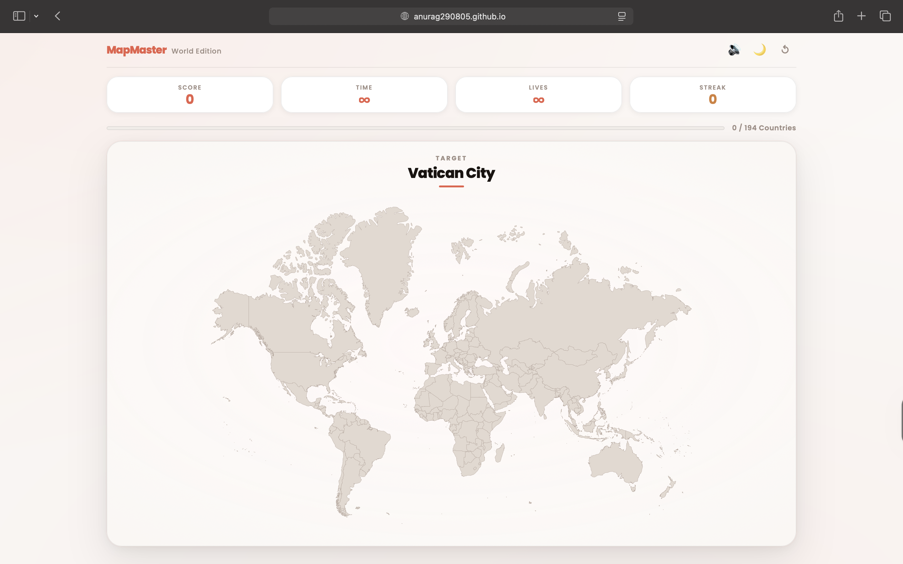
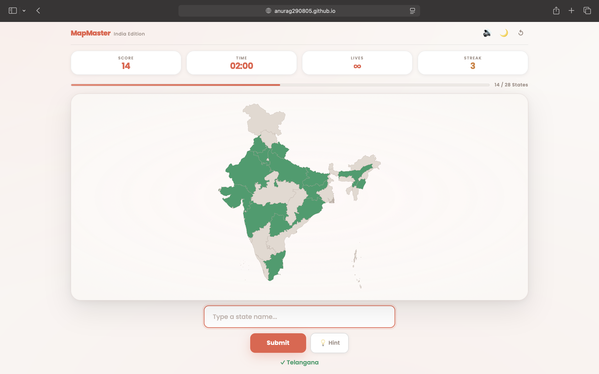
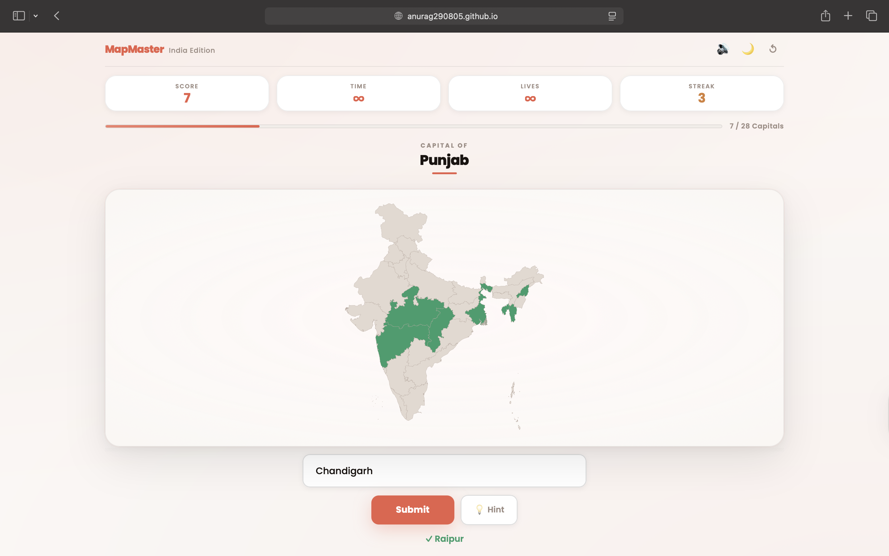
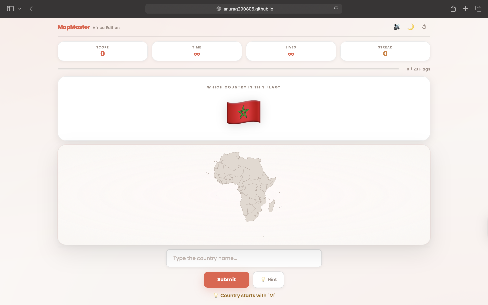

# 🗺️ MapMaster

A full-featured geography quiz web app to test your knowledge of states and countries across the world — built entirely with vanilla HTML, CSS, and JavaScript.

---

## 📸 Screenshots

### 🏠 Start Screen

*Clean hero landing with scope selection — Country, Continent, or World.*

### 🌍 Select Continent

*Choose from Europe, North America, South America, Africa, Asia, or Oceania.*

### 🗺️ Select Country

*Choose a country (India or USA) to quiz on its states.*

### ⚙️ Game Setup

*Pick one of four game types and a mode (Practice or Challenge) before starting.*

### 🎯 Locate on Map — World Edition

*A target country is shown — click it on the interactive SVG map to score. Score, streak, timer, and progress bar update in real time.*

### ✍️ Type the Name — India Edition

*Type state names from memory to fill the map green. Half of India's 28 states identified here with a streak of 3.*

### 🏛️ Capitals Mode — India Edition

*The highlighted state is shown on the map — type its capital city to score. Here: "Capital of Punjab" with the answer Chandigarh.*

### 🚩 Flags Mode — Africa Edition

*A flag emoji is displayed — identify which country it belongs to. Hint system reveals the first letter of the answer.*

---

## ✨ Features

- **Four Game Types:**
  - *Type the Name* — Type every region name from memory to fill the map
  - *Locate on Map* — A target region is named; click it on the SVG map
  - *Capitals* — The region is highlighted; type its capital city
  - *Flags* — A flag is shown; identify which country it belongs to
- **Two Game Modes** — *Practice*: no timer, no lives, play at your own pace. *Challenge*: countdown timer + limited lives for pressure gameplay.
- **8 Map Scopes** — India (28 states), USA (50 states), Europe, North America, South America, Africa, Asia, Oceania, and World (194 countries).
- **Live SVG Map** — Interactive SVG maps with hover highlights, correct-answer colouring, and wrong-click red flash animations.
- **Hint System** — Stuck? Request a hint to reveal the first letter of the answer.
- **Streak Tracking** — Current streak and best streak tracked and displayed in real time throughout each game.
- **Progress Bar** — Animated fill bar showing how many regions have been correctly identified.
- **Sound Effects** — Subtle audio feedback on correct and incorrect answers, with a toggle to mute.
- **Dark Mode** — Full dark theme toggle with `localStorage` persistence across sessions.
- **Confetti Win Animation** — Canvas-based confetti burst on successfully completing a map.
- **Responsive Design** — Works across desktop and mobile screen sizes.

---

## 🛠️ Tech Stack

| Layer | Technology |
|---|---|
| Language | HTML5, CSS3, Vanilla JavaScript (ES6+) |
| Maps | Inline SVG files per region |
| Styling | Custom CSS with CSS variables, Poppins font |
| Storage | `localStorage` for theme preference |
| Audio | Web Audio API (inline base64 WAV) |
| Animation | CSS keyframes + Canvas API (confetti) |

No frameworks, no build tools, no dependencies. Open `index.html` and it runs.

---

## 🚀 Getting Started

### 1. Clone the repository
```bash
git clone https://github.com/anurag290805/mapmaster.git
cd mapmaster
```

### 2. Add SVG maps

Place your SVG map files in a `svg/` folder. Required files:
```
svg/india.svg
svg/usa.svg
svg/europe.svg
svg/north america.svg
svg/south america.svg
svg/africa.svg
svg/asia.svg
svg/oceania.svg
svg/world.svg
```

Each SVG should have `<path>` elements with `aria-label`, `id`, `name`, `data-name`, or a child `<title>` tag identifying the region name.

### 3. Open the app
```bash
open index.html
# or just double-click index.html in your file explorer
```

No server required for most browsers. For SVG cross-origin loading, serve locally:
```bash
python3 -m http.server 8080
# then visit http://localhost:8080
```

---

## 📁 Project Structure
```
mapmaster/
│
├── index.html          # Full app markup — all screens
├── script.js           # All game logic, state, and event handling
├── style.css           # Complete styling with CSS variables and dark theme
│
└── svg/
    ├── india.svg
    ├── usa.svg
    ├── europe.svg
    ├── north america.svg
    ├── south america.svg
    ├── africa.svg
    ├── asia.svg
    ├── oceania.svg
    └── world.svg
```

---

## 🧠 Key Technical Highlights

**Dynamic SVG interaction** — SVG maps are loaded via `<object>` tags and manipulated through `contentDocument`. Paths are queried by `aria-label`, `id`, `data-name`, or child `<title>` elements to support a wide variety of SVG formats.

**Auto-fit viewBox** — On SVG load, the script computes the real bounding box across all `<path>` elements and sets a tight `viewBox`, ensuring maps with offset coordinates display correctly and fill the container.

**Multi-scope map engine** — A single `MAPS` data object drives all 8 map contexts. Switching scope swaps the SVG source, region list, and all UI labels with one `applyMap()` call.

**Four distinct game modes** — Each mode (Type, Locate, Capitals, Flags) shares the same underlying game state and HUD but swaps in a different input and prompt mechanism, keeping the codebase DRY and extensible.

**Hint system** — A lightweight hint engine reveals the first letter of the target answer on demand without penalising the player, keeping the experience approachable for learners.

**Streak & accuracy tracking** — Current and best streaks are maintained across rounds within a session. Accuracy is computed from total attempts vs. correct answers on the win screen.

**Confetti engine** — A pure Canvas API particle system with random colours, spin, velocity, and a fade-out over 5 seconds — no external libraries.

**Screen transition system** — CSS animation classes (`screen-enter`, `screen-exit`) are applied programmatically for smooth fade-slide transitions between all app screens.

---

## 📋 What I Learned

- Manipulating embedded SVG documents via `contentDocument` across different SVG formats
- Building a multi-screen single-page app with pure JavaScript state management
- Computing dynamic SVG `viewBox` values from path bounding boxes for universal map support
- Implementing four distinct game mechanics (typing, clicking, capitals, flags) within a single unified game loop
- Designing a scalable data-driven architecture that extends easily to new maps and regions

---

## 👤 Author

**Anurag Srivastava**  
[GitHub](https://github.com/anurag290805)

---

## 📄 License

This project is licensed under the [MIT License](LICENSE).
